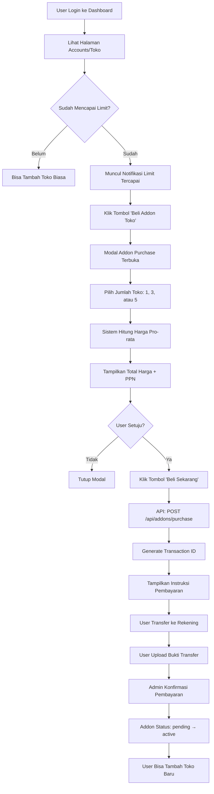

# Workflow: User Beli Addon Tambah Toko

**Date:** 15 Januari 2026  
**Feature:** Addon Upselling - Extra Accounts  
**Status:** ✅ Implemented & Deployed

---

## 🎯 Overview

Workflow ini menjelaskan langkah-langkah lengkap ketika user ingin membeli addon untuk menambah jumlah toko yang bisa dikelola.

---

## 📊 User Journey Flow



---

## 🔄 Technical Flow

### 1. Check User Limits

**Endpoint:** `GET /api/user/effective-limits`

**Request:**
```http
GET https://app.adspilot.id/api/user/effective-limits
Authorization: Bearer <token>
```

**Response:**
```json
{
  "success": true,
  "data": {
    "planLimits": {
      "maxAccounts": 2
    },
    "activeAddons": [],
    "effectiveLimits": {
      "maxAccounts": 2
    },
    "usage": {
      "accounts": 2
    },
    "canAddAccount": false
  }
}
```

**UI Action:**
- Jika `canAddAccount = false` → Tampilkan tombol "Beli Addon Toko"
- Jika `canAddAccount = true` → Tampilkan tombol "Tambah Toko" biasa

---

### 2. Calculate Addon Price

**Endpoint:** `GET /api/addons/calculate-price?quantity=1`

**Request:**
```http
GET https://app.adspilot.id/api/addons/calculate-price?quantity=1
Authorization: Bearer <token>
```

**Response:**
```json
{
  "success": true,
  "data": {
    "quantity": 1,
    "pricePerMonth": 99000,
    "remainingDays": 25,
    "prorataMultiplier": 0.83,
    "pricePerAccount": 82170,
    "subtotal": 82170,
    "ppn": 9039,
    "total": 91209,
    "subscriptionEndDate": "2026-02-09"
  }
}
```

**UI Display:**
```
┌─────────────────────────────────────┐
│  Beli Addon Toko Tambahan           │
├─────────────────────────────────────┤
│  Pilih Jumlah:                      │
│  ○ +1 Toko  - Rp 91.209             │
│  ○ +3 Toko  - Rp 273.627 (Hemat 16%)│
│  ○ +5 Toko  - Rp 456.045 (Hemat 19%)│
│                                     │
│  Sisa Waktu Subscription: 25 hari   │
│  Berlaku Hingga: 09 Feb 2026        │
│                                     │
│  [Batal]  [Beli Sekarang]          │
└─────────────────────────────────────┘
```

---

### 3. Purchase Addon

**Endpoint:** `POST /api/addons/purchase`

**Request:**
```http
POST https://app.adspilot.id/api/addons/purchase
Authorization: Bearer <token>
Content-Type: application/json

{
  "quantity": 1,
  "addonType": "extra_accounts"
}
```

**Response:**
```json
{
  "success": true,
  "message": "Transaksi addon berhasil dibuat. Silakan lakukan pembayaran.",
  "data": {
    "transactionId": "ADDON-1736929200000-ABC123",
    "addonId": 1,
    "quantity": 1,
    "pricing": {
      "pricePerAccount": 82170,
      "subtotal": 82170,
      "ppn": 9039,
      "total": 91209
    },
    "paymentInstructions": {
      "method": "bank_transfer",
      "bankName": "BCA",
      "accountNumber": "1234567890",
      "accountName": "AdsPilot",
      "amount": 91209,
      "note": "Transfer dengan berita: ADDON-1736929200000-ABC123"
    },
    "status": "pending",
    "expiresAt": "2026-01-16T15:10:00Z"
  }
}
```

**UI Display:**
```
┌─────────────────────────────────────────────┐
│  ✅ Transaksi Berhasil Dibuat               │
├─────────────────────────────────────────────┤
│  ID Transaksi: ADDON-1736929200000-ABC123   │
│  Total Pembayaran: Rp 91.209                │
│                                             │
│  📋 Instruksi Pembayaran:                   │
│  ─────────────────────────────────────────  │
│  Bank: BCA                                  │
│  No. Rekening: 1234567890                   │
│  Atas Nama: AdsPilot                        │
│  Jumlah: Rp 91.209                          │
│                                             │
│  ⚠️ Penting:                                │
│  Sertakan berita transfer:                  │
│  ADDON-1736929200000-ABC123                 │
│                                             │
│  ⏰ Batas Waktu: 16 Jan 2026, 15:10         │
│                                             │
│  [Upload Bukti Transfer]                    │
└─────────────────────────────────────────────┘
```

---

### 4. Upload Payment Proof

**Endpoint:** `POST /api/transactions/upload-proof`

**Request:**
```http
POST https://app.adspilot.id/api/transactions/upload-proof
Authorization: Bearer <token>
Content-Type: multipart/form-data

{
  "transactionId": "ADDON-1736929200000-ABC123",
  "paymentProof": <file>
}
```

**Response:**
```json
{
  "success": true,
  "message": "Bukti pembayaran berhasil diupload. Menunggu konfirmasi admin.",
  "data": {
    "transactionId": "ADDON-1736929200000-ABC123",
    "status": "pending_verification"
  }
}
```

---

### 5. Admin Confirmation (Manual)

**Admin Panel Action:**
1. Admin login ke Admin Dashboard
2. Buka menu "Transactions" → "Pending Payments"
3. Lihat transaksi `ADDON-1736929200000-ABC123`
4. Cek bukti transfer
5. Klik "Konfirmasi Pembayaran"

**Backend Process:**
```sql
-- Update transaction status
UPDATE transactions 
SET status = 'completed', 
    verified_at = NOW(),
    verified_by = 'admin_user_id'
WHERE transaction_id = 'ADDON-1736929200000-ABC123';

-- Activate addon
UPDATE account_addons 
SET status = 'active',
    updated_at = NOW()
WHERE transaction_id = 'ADDON-1736929200000-ABC123';
```

---

### 6. User Gets Notification

**Email Notification:**
```
Subject: ✅ Pembayaran Addon Toko Berhasil Dikonfirmasi

Halo [User Name],

Pembayaran Anda untuk addon toko tambahan telah dikonfirmasi!

Detail Addon:
- Jumlah Toko Tambahan: 1
- Total Pembayaran: Rp 91.209
- Berlaku Hingga: 09 Feb 2026

Anda sekarang dapat menambahkan toko baru di dashboard Anda.

Terima kasih,
Tim AdsPilot
```

**Telegram Notification (if enabled):**
```
🎉 Pembayaran Addon Berhasil!

✅ +1 Toko tambahan telah aktif
💰 Rp 91.209
📅 Berlaku hingga: 09 Feb 2026

Silakan tambahkan toko baru di dashboard Anda.
```

---

### 7. User Adds New Store

**Endpoint:** `POST /api/accounts/add`

**Before Addon:**
```json
{
  "effectiveLimits": {
    "maxAccounts": 2
  },
  "usage": {
    "accounts": 2
  },
  "canAddAccount": false
}
```

**After Addon Activated:**
```json
{
  "effectiveLimits": {
    "maxAccounts": 3
  },
  "usage": {
    "accounts": 2
  },
  "canAddAccount": true
}
```

**User can now add 1 more store!**

---

## 💰 Pricing Examples

### Example 1: Sisa 30 Hari
```
Subscription End: 14 Feb 2026
Today: 15 Jan 2026
Remaining Days: 30 days

Calculation:
- Base Price: Rp 99.000/bulan
- Pro-rata: (30/30) × Rp 99.000 = Rp 99.000
- PPN 11%: Rp 10.890
- Total: Rp 109.890
```

### Example 2: Sisa 15 Hari
```
Subscription End: 30 Jan 2026
Today: 15 Jan 2026
Remaining Days: 15 days

Calculation:
- Base Price: Rp 99.000/bulan
- Pro-rata: (15/30) × Rp 99.000 = Rp 49.500
- PPN 11%: Rp 5.445
- Total: Rp 54.945
```

### Example 3: Sisa 7 Hari (Minimum)
```
Subscription End: 22 Jan 2026
Today: 15 Jan 2026
Remaining Days: 7 days

Calculation:
- Base Price: Rp 99.000/bulan
- Pro-rata: (7/30) × Rp 99.000 = Rp 23.100
- PPN 11%: Rp 2.541
- Total: Rp 25.641
```

### Example 4: Kurang dari 7 Hari (REJECTED)
```
Subscription End: 20 Jan 2026
Today: 15 Jan 2026
Remaining Days: 5 days

❌ Error: "Subscription Anda akan berakhir dalam kurang dari 7 hari. 
Perpanjang subscription terlebih dahulu sebelum membeli addon."
```

---

## 🔄 Renewal Flow

### When Subscription Renews

**Scenario:** User punya addon aktif, subscription akan diperpanjang

**Renewal Invoice:**
```
┌─────────────────────────────────────────┐
│  Invoice Perpanjangan Subscription      │
├─────────────────────────────────────────┤
│  Paket: 3 Bulan                         │
│  Harga: Rp 750.000                      │
│                                         │
│  ✅ Addon Toko Tambahan:                │
│  +1 Toko × 3 bulan = Rp 297.000         │
│                                         │
│  Subtotal: Rp 1.047.000                 │
│  PPN 11%: Rp 115.170                    │
│  Total: Rp 1.162.170                    │
│                                         │
│  ⚠️ Addon akan otomatis diperpanjang    │
│  [Hapus Addon]  [Bayar Sekarang]       │
└─────────────────────────────────────────┘
```

**User Options:**
1. **Keep Addon** → Bayar Rp 1.162.170 (paket + addon)
2. **Remove Addon** → Bayar Rp 825.000 (paket saja)

---

## 📋 Business Rules

### ✅ Allowed

1. **Beli addon** jika subscription masih ≥ 7 hari
2. **Beli multiple addons** (max 10 toko per transaksi)
3. **Addon mengikuti** subscription end_date
4. **Auto-include** di renewal invoice

### ❌ Not Allowed

1. **Beli addon** jika subscription < 7 hari
2. **Beli addon** tanpa subscription aktif
3. **Addon standalone** (harus ada subscription)
4. **Refund** setelah addon aktif

### 🔄 Edge Cases

**Case 1: Addon Expires**
- Status: `active` → `expired`
- Toko tambahan: Aktif → Non-aktif
- Data: Tetap tersimpan
- User: Tidak bisa akses toko tersebut

**Case 2: Upgrade Plan**
- Plan baru punya limit lebih tinggi dari plan + addon
- Addon tidak auto-renew
- User dinotifikasi

**Case 3: Downgrade Plan**
- Plan baru punya limit lebih rendah
- User harus pilih toko mana yang tetap aktif
- Addon bisa tetap dibeli jika perlu

---

## 🧪 Testing Checklist

### User Flow Testing

- [ ] User dengan limit penuh bisa lihat tombol "Beli Addon"
- [ ] Calculate price menampilkan harga yang benar
- [ ] Pro-rata calculation akurat
- [ ] Purchase berhasil generate transaction
- [ ] Payment instructions ditampilkan dengan benar
- [ ] Upload bukti transfer berhasil
- [ ] Admin bisa konfirmasi pembayaran
- [ ] Addon status berubah ke `active`
- [ ] User bisa tambah toko setelah addon aktif
- [ ] Notification email terkirim
- [ ] Telegram notification terkirim (if enabled)

### Edge Cases Testing

- [ ] Error jika subscription < 7 hari
- [ ] Error jika tidak ada subscription aktif
- [ ] Addon expires sesuai subscription end_date
- [ ] Renewal invoice include addon
- [ ] User bisa remove addon dari renewal
- [ ] Upgrade plan handle addon dengan benar
- [ ] Downgrade plan warning ditampilkan

---

## 📊 Database State Changes

### Before Purchase
```sql
-- User limits
SELECT * FROM subscriptions WHERE user_id = 'user123';
-- plan_id: '3-month', end_date: '2026-02-09'

SELECT * FROM account_addons WHERE user_id = 'user123';
-- (empty)

-- Effective limits: 2 toko
```

### After Purchase (Pending)
```sql
-- Transaction created
INSERT INTO transactions (
  transaction_id, user_id, status, total_amount
) VALUES (
  'ADDON-1736929200000-ABC123', 'user123', 'pending', 91209
);

-- Addon created (pending)
INSERT INTO account_addons (
  user_id, quantity, status, transaction_id, end_date
) VALUES (
  'user123', 1, 'pending', 'ADDON-1736929200000-ABC123', '2026-02-09'
);

-- Effective limits: Still 2 toko (addon not active yet)
```

### After Payment Confirmed
```sql
-- Transaction updated
UPDATE transactions 
SET status = 'completed', verified_at = NOW()
WHERE transaction_id = 'ADDON-1736929200000-ABC123';

-- Addon activated
UPDATE account_addons 
SET status = 'active', updated_at = NOW()
WHERE transaction_id = 'ADDON-1736929200000-ABC123';

-- Effective limits: Now 3 toko! (2 from plan + 1 from addon)
```

---

## 🎯 Success Metrics

### Key Metrics to Track

1. **Conversion Rate**
   - Users yang lihat addon offer → Users yang beli
   - Target: > 15%

2. **Average Addon Quantity**
   - Rata-rata jumlah toko yang dibeli per transaksi
   - Target: 1.5 toko

3. **Payment Completion Rate**
   - Transaksi created → Transaksi completed
   - Target: > 80%

4. **Renewal Rate**
   - Addon yang di-renew saat subscription perpanjang
   - Target: > 70%

5. **Revenue Impact**
   - Total revenue dari addon per bulan
   - Target: 20% dari total subscription revenue

---

**Status:** ✅ Workflow Complete & Documented  
**Last Updated:** 15 Januari 2026 15:20 WIB  
**Next:** UI Implementation (Phase 2)
